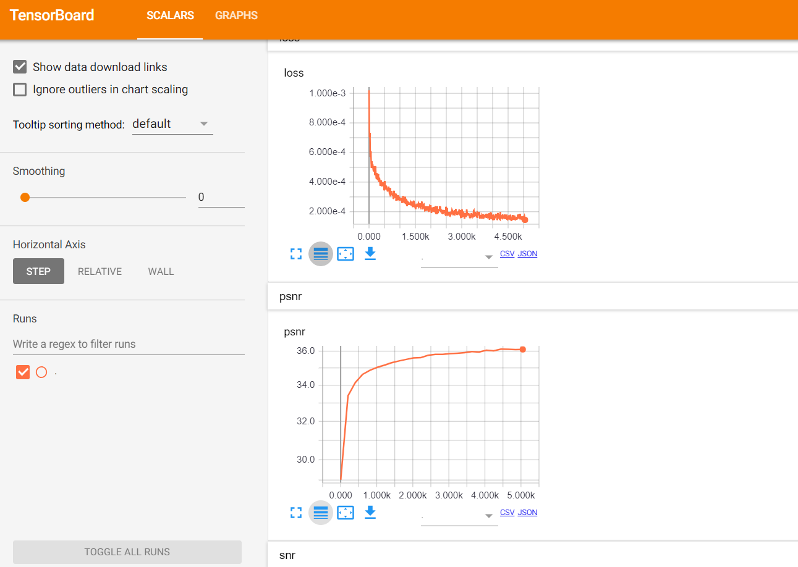
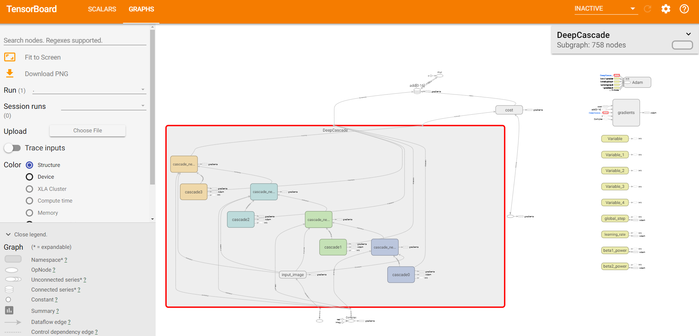

# Compressive Sensing MRI using Deep Learning
Explore Deep Learning Architectures for MRI image reconstruction from highly undersampled k-space data using different undersampling masks.

# Dataset
The dataset we used for this project is confidential. So, please use the data only for evaluation of this project. For more information please contact LIONS laboratory (Gözcü Baran <baran.goezcue@epfl.ch>)

# Report
Please find pdf report on the work in `Report` folder.

# Running the code
## Description of files
1. `cnn_deep_cascade.py` contains modules for creating DeepCascade CNN Architecture and training the model.
2. `create_dataset.py` contains modules for data augmentation and image normalization to values between -1 and 1.
3. `data_processor.py` contains modules for loading data in batches while training the model so that only one batch is loaded into memory for a given training iteration.
4. `predict_test.py` is a script for loading the trained model and performing prediction on given test samples.
5. `utils.py` contains utility functions required by other modules
6. `run.py` is the main file to train the model.

## External Libraries used
1. `Tensorflow` for building and training the model using GPU version.
2. `Skimage` for saving and displaying images

## Training model
For training the model, please use NVIDIA GPU with compute capacity greater or equal to 3.5. For multiple GPUs, you can set visible `CUDA` devices for training by setting environment variable `CUDA_VISIBLE_DEVICES` as `0` or `1`, where `0`, `1` is device id.

To train the model with default DeepCascade architecture, run the following command

`python run.py`

This will train the model and at every epoch, the prediction on `test data` is saved in `prediction*` folder. To change the default path locations, you can supply them as command line variables:

`--train_data_path` Training data path.  
`--test_data_path` Test data path.  
`--prediction_path` Path where prediction on test is saved after every epochs.  
`--model_output_path` Path where model is saved after training.  
`--create_dataset` Bool that can be provided to turn off data augmentation.  

# Visualization in Tensorboard
To visualize the training and computation graph, you can run tensorboard by the following command.  
`tensorboard --logdir="model_output_path"`, where `model_output_path` is the folder where tensorboard `events` are saved. For default setting, use `model_output_path` as `output_deep_cascade_nc4_nlayers3`.  

